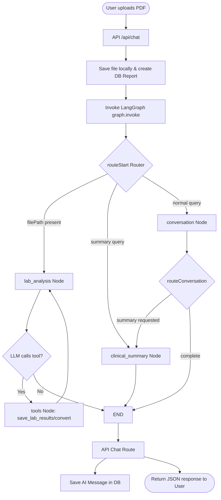

# Architecture

**Analysis Date:** 2026-06-02

## Pattern Overview

**Overall:** Next.js Full-stack Web Application with a stateful LangGraph Agentic Backend.

**Key Characteristics:**
- **App Router Architecture:** Next.js App Router for UI page generation and route handlers.
- **Stateful Agent Workflow:** LangGraph orchestrates specialized clinical/conversational agent nodes.
- **Hybrid Data Access:** Utilizes both Prisma ORM (standard operations) and raw PostgreSQL Neon pools (legacy auth queries).
- **Session-Based Authentication:** Direct httpOnly cookie verification server-side.

---

## Layers

**1. Routing & API Layer:**
- **Purpose:** Exposes frontend views and processes user payloads (chat messages, file uploads).
- **Contains:** Next.js Server Components, client dashboards (`components/agent-client-page.tsx`), and API endpoints.
- **Key Files:** 
  - `app/api/chat/route.ts` - Main entry point routing human chats into the agent graph.
  - `app/page.tsx` - Public landing page.
- **Depends on:** Agentic Layer and Service Layer.

**2. Agentic Layer (LangGraph):**
- **Purpose:** Stateful multi-agent orchestrator determining the clinical and conversational processing path.
- **Contains:** State graphs, conditional routers, specialized worker nodes, and execution tools.
- **Key Files:**
  - `lib/agent/graph.ts` - Builds and compiles the LangGraph state machine.
  - `lib/agent/state.ts` - Schema representing the chat state.
  - `lib/agent/nodes/` - Nodes handling conversation, lab analysis, and clinical summaries.
  - `lib/agent/tools/` - Action tools like saving database results and converting units.
- **Depends on:** Service Layer, Model Provider, and Database Layer.

**3. Service Layer:**
- **Purpose:** Core business logic, file storage management, PDF reading, and user mutations.
- **Contains:** File processing modules, Prisma database CRUD utilities, and Next.js Server Actions.
- **Key Files:**
  - `lib/services/processing.ts` - Local PDF saving and type checking.
  - `lib/services/chat.ts` - Chat creations, messages logging, and clinical report management.
  - `lib/services/actions.ts` - Onboarding updates, user signup/login server actions.
  - `lib/actions.ts` - Legacy server actions using raw PostgreSQL connections.
- **Depends on:** Database Layer.

**4. Database & ORM Layer:**
- **Purpose:** Abstracting and executing PostgreSQL operations against Neon Database.
- **Contains:** Connection instances, pool configurations, and Prisma-generated client outputs.
- **Key Files:**
  - `lib/db/client.ts` - Instantiates serverless-compatible PrismaClient.
  - `lib/db.ts` - Legacy database connection pool using raw `@neondatabase/serverless` PG pools.
  - `prisma/schema.prisma` - DB tables, relational joins, and database enums.

---

## Data Flow

**Typical Lab Report Analysis Flow:**

**Detailed Step-by-Step Flow:**
1. **Request Payload:** The client sends the chat message list, optional Base64 file upload, current chatId, and highlighted selected text to `app/api/chat/route.ts`.
2. **File Capture:** If a file is uploaded, `saveUploadedFile` writes the PDF to `public/uploads/` and generates static access URLs.
3. **Early DB Sync:** If a new report is processed, the system creates a blank `reports` row and links it to the `chats` record to ensure proper entity associations.
4. **LangGraph Activation:** The route passes the message history, document file paths, database report IDs, and highlighted sections to the `graph.invoke()` call.
5. **Conditional Routing:** 
   - `routeStart` redirects traffic to `lab_analysis` if a new file path is found, `clinical_summary` if summary keywords are detected, or falls back to `conversation`.
6. **Agent Processing:**
   - **Lab Analysis Agent:** Uses `PDFLoader` to extract medical text. Invokes the model bound with `save_lab_results` and `convert_lab_units` tools. Saves abnormal results to the DB, then loops until complete.
   - **Conversation Agent:** Provides responsive clinical Q&A.
   - **Clinical Summary Agent:** Consolidates analysis into structured medical summaries.
7. **Response Capture & Save:** The final AI response text is stored in `messages` via `saveMessageAsync`, and returned to the dashboard client.

---

## Key Abstractions

- **StateGraph:** A compiled transition matrix coordinating clinical and conversational agents.
- **AgentState:** Type definitions holding raw text, lists of messages, current report IDs, and parsed lab values.
- **Server Actions:** Safe, server-side data mutations annotated with `'use server'` to streamline user registration, logins, and onboarding updates.
- **Prisma Client:** A type-safe programmatic query client reflecting DB schema definitions.

---

## Error Handling

- **Database Safety:** Direct raw PostgreSQL client connections in `lib/actions.ts` execute within safe try/catch structures and guarantee connection release within `finally` blocks.
- **Inference Resiliency:** Graph model invocations include a strict `60000ms` Promise timeout guard in `lib/agent/nodes/lab-analysis.ts` to prevent infinite hanging runs.
- **File System Guardrails:** File processors wrap uploads with standard exception catchers to prevent runtime system crashes on faulty uploads.

---

## Cross-Cutting Concerns

- **Validation:**
  - Input parsing using custom type coercion and `Zod` schemas at the tool parameters boundary.
  - Server actions validate integer parameters (e.g. `age`).
- **Security:**
  - Secure credential storage using `bcrypt` (10 rounds).
  - Session verification via secure `httpOnly` cookie state validation.
- **Logging:**
  - Dedicated server-side command-line debug logs tracking route invocation, LangGraph transitions, and message counts.

---

*Architecture analysis: 2026-06-02*
*Update when major patterns change*
