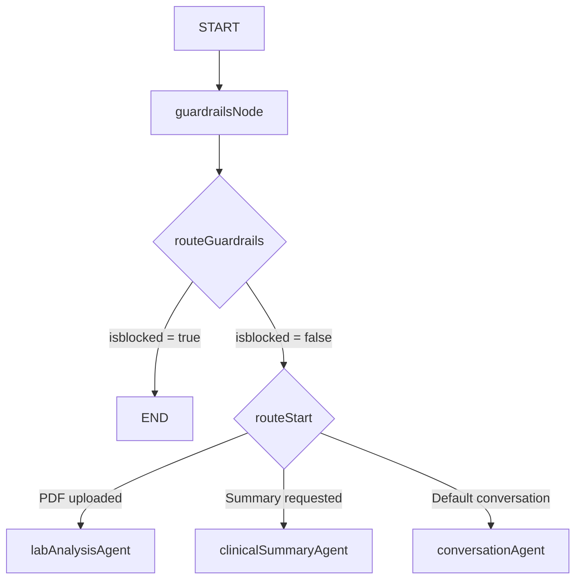

# Phase 1: Agentic Diagnosis Guardrails & Logic - Technical Research

**Date:** 2026-06-02

## 1. Stack & Runtime Capabilities

Phase 1 operates entirely inside the Next.js API boundary (`app/api/chat/route.ts`) and the compiled LangGraph workspace (`lib/agent/`):
- **Orchestration:** LangGraph `StateGraph` will manage state nodes, custom routers, and conditional transition edge mappings.
- **Safety Classifier:** ChatOllama with temperature `0.0` running the `gpt-oss:120b-cloud` model performs zero-shot JSON safety classification (`lib/agent/nodes/guardrails.ts`).
- **Clinical Synthesizer:** ChatOllama with temperature `0.2` executes multi-step symptom-abnormality consolidation (`lib/agent/nodes/clinical-summary.ts`).

---

## 2. Technical Architectures & Node Integration

Currently, the `guardrailsNode` is defined in `lib/agent/nodes/guardrails.ts` but is completely **unregistered** in the main compiled graph (`lib/agent/graph.ts`). Similarly, the guardrail routing helper in `lib/agent/graph_snippets.ts` has not been integrated.

### Graph Architecture Re-alignment

To establish the safety gate as the entry boundary, we must modify the compiled StateGraph execution path:



### Transition Mappings to Implement:
1. **Add Node:** `.addNode("guardrails", guardrailsNode)` inside `lib/agent/graph.ts`.
2. **Transition Source:** Set `START` pointing directly to `"guardrails"`.
3. **Conditional Flow:**
   ```typescript
   .addConditionalEdges("guardrails", routeGuardrails, {
       conversation: "conversation",
       lab_analysis: "lab_analysis",
       clinical_summary: "clinical_summary",
       [END]: END,
   })
   ```

---

## 3. Clinical Synthesis Prompt Engineering

We must extend `CLINICAL_SUMMARY_PROMPT` in `lib/agent/prompts.ts` to mandate:
1. **Factual Evidence Citing:** For every symptom or abnormal value, the LLM must explicitly list the source (e.g. `[CITED: Patient reported onset of 3 days]` or `[CITED: Lab ALT = 52 U/L (High)]`).
2. **Symptom History Structuring:** Mandating HPI breakdown (Onset, Duration, Severity, Associated factors).
3. **Diagnostic Conclusion Refusal:** Enforcing refusal if evidence is speculative. If symptoms do not align with any lab results, the agent must output a clean "Underdetermined etiology" warning rather than guessing.

---

## 4. Safety Guardrails & Disclaimers

### Disclaimer Implementation:
Every response generated from the `clinicalSummaryAgent` must automatically have a warm medical disclaimer appended. We will build an active formatter wrapper inside `lib/agent/nodes/clinical-summary.ts` or inside `CLINICAL_SUMMARY_PROMPT`:

```markdown
> ⚠️ **Clinical Assistant Note:** This summary is synthesized based on self-reported patient symptoms and uploaded laboratory results. It does not constitute professional medical advice, a prescription, or an official diagnosis. Please share these findings with a licensed healthcare provider for proper clinical correlation.
```

---

## 5. Validation Architecture

To ensure Dimension 8 validation compliance, we will implement:
- **Safety Classification Test:** Verifying that input strings like "what pills should I buy" or "tell me what disease I have" trigger a safety block (`isblocked: true`).
- **Citation Assertion Checks:** Programmatic checks verifying that final clinical summaries contain active `[CITED: ...]` tags and medical disclaimers.

---

*Research complete: .planning/phases/01-agentic-diagnosis-guardrails-logic/01-RESEARCH.md*
